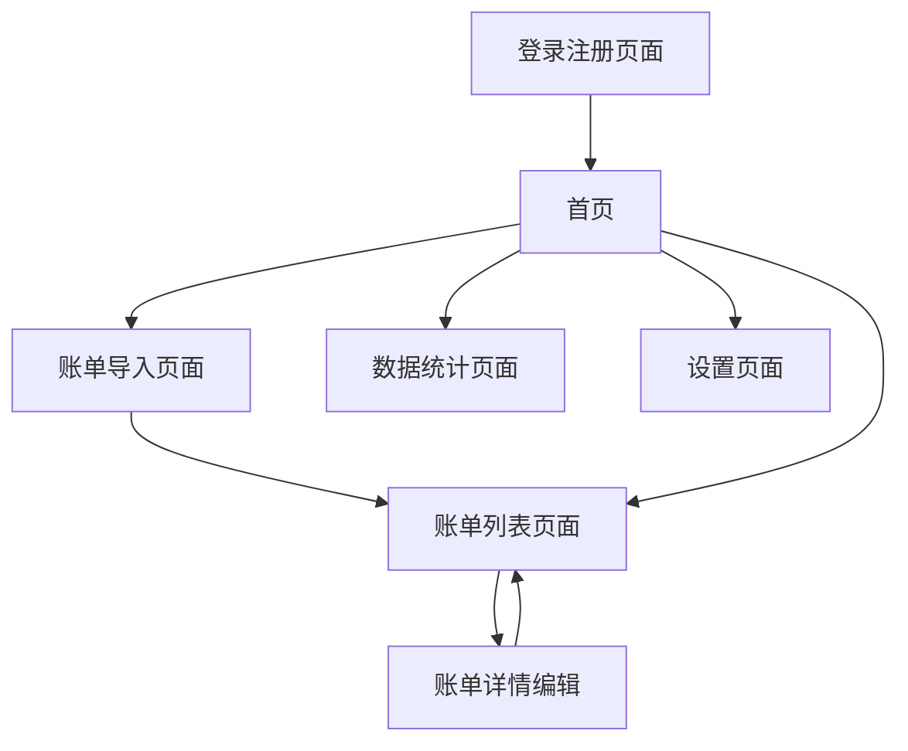

# FinMind 全记账产品需求文档

## 1. Product Overview
FinMind 全记账是一款跨平台智能记账应用，通过本地AI模型自动解析账单，帮助用户轻松管理个人财务。
- 解决用户手动记账繁琐、账单分类困难的问题，面向有记账需求的个人用户。
- 通过智能解析和可视化分析，让用户更好地了解消费习惯和财务状况。
- 目标成为用户首选的智能记账工具，提升个人财务管理效率。

## 2. Core Features

### 2.1 User Roles
| Role | Registration Method | Core Permissions |
|------|---------------------|------------------|
| 普通用户 | 邮箱注册 | 可使用所有基础功能，包括账单导入、数据同步、图表查看等 |

### 2.2 Feature Module
我们的记账应用包含以下主要页面：
1. **登录注册页面**：用户认证、账户创建。
2. **首页**：账单概览、快速导入入口、收支统计卡片。
3. **账单导入页面**：文件选择、AI解析、结果预览、批量编辑。
4. **账单列表页面**：账单展示、筛选排序、详情查看、手动编辑。
5. **数据统计页面**：月度收支图表、分类饼图、趋势分析。
6. **设置页面**：数据同步、备份恢复、个人信息管理。

### 2.3 Page Details
| Page Name | Module Name | Feature description |
|-----------|-------------|---------------------|
| 登录注册页面 | 用户认证模块 | 提供邮箱注册、登录功能，JWT token管理，密码找回 |
| 首页 | 概览模块 | 显示当月收支总额、最近账单列表、快速导入按钮 |
| 首页 | 快速操作模块 | 提供账单导入入口、手动添加账单、数据同步状态 |
| 账单导入页面 | 文件选择模块 | 支持CSV/Excel/PDF文件选择，文件格式验证 |
| 账单导入页面 | AI解析模块 | 调用本地模型解析账单，生成标准JSON格式数据 |
| 账单导入页面 | 结果预览模块 | 展示解析结果，支持批量编辑、分类修正、确认保存 |
| 账单列表页面 | 列表展示模块 | 分页显示账单，支持时间/金额/分类筛选，搜索功能 |
| 账单列表页面 | 详情编辑模块 | 单条账单详情查看，支持手动编辑、删除操作 |
| 数据统计页面 | 图表展示模块 | 月度收支柱状图、分类饼图、收支趋势线图 |
| 数据统计页面 | 数据分析模块 | 消费习惯分析、预算对比、异常支出提醒 |
| 设置页面 | 数据管理模块 | 云端同步、本地备份、数据导出功能 |
| 设置页面 | 个人中心模块 | 用户信息编辑、密码修改、退出登录 |

## 3. Core Process

**用户主要操作流程：**
1. 用户注册/登录 → 进入首页查看账单概览
2. 点击导入按钮 → 选择账单文件 → AI自动解析 → 预览并确认结果 → 保存到本地
3. 在账单列表页面查看所有记录，支持筛选和编辑
4. 在统计页面查看图表分析，了解消费情况
5. 通过设置页面进行数据同步和备份

## 4. User Interface Design

### 4.1 Design Style
- **主色调**：深蓝色 (#1E3A8A) 作为主色，浅蓝色 (#3B82F6) 作为辅助色
- **按钮样式**：圆角矩形按钮，主按钮使用渐变效果
- **字体**：系统默认字体，标题 18px，正文 14px，辅助文字 12px
- **布局风格**：卡片式设计，顶部导航栏，底部Tab导航
- **图标风格**：线性图标，简洁现代，配合品牌色彩

### 4.2 Page Design Overview
| Page Name | Module Name | UI Elements |
|-----------|-------------|-------------|
| 登录注册页面 | 用户认证模块 | 简洁表单设计，白色背景，蓝色主按钮，底部切换链接 |
| 首页 | 概览模块 | 顶部收支卡片（绿色收入/红色支出），白色背景，阴影效果 |
| 首页 | 快速操作模块 | 浮动操作按钮（FAB），蓝色渐变，底部居中位置 |
| 账单导入页面 | 文件选择模块 | 虚线边框上传区域，拖拽提示，支持的文件格式说明 |
| 账单导入页面 | 结果预览模块 | 表格形式展示，可编辑单元格，批量操作工具栏 |
| 账单列表页面 | 列表展示模块 | 卡片式列表，左侧分类图标，右侧金额（红绿区分收支） |
| 数据统计页面 | 图表展示模块 | 响应式图表，柔和色彩搭配，交互式数据点 |
| 设置页面 | 设置项模块 | 分组列表设计，右箭头指示，开关控件 |

### 4.3 Responsiveness
应用采用移动端优先设计，支持iOS和Android平台，针对触摸交互进行优化，包括合适的点击区域大小和手势操作支持。