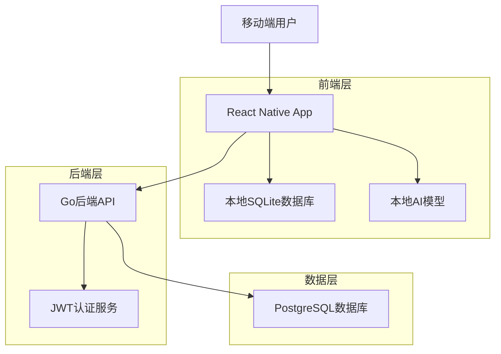
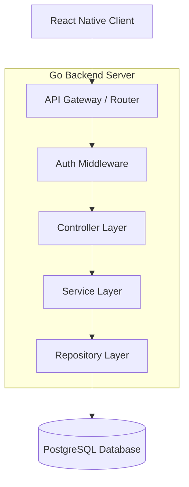
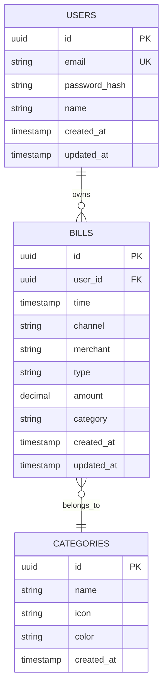

# FinMind 全记账技术架构文档

## 1. Architecture design



## 2. Technology Description

- Frontend: React Native@0.72 + TypeScript@5.0 + React Navigation@6 + Redux Toolkit@1.9 + SQLite@6.0
- Backend: Go@1.21 + Gin@1.9 + GORM@1.25 + JWT-Go@5.0
- Database: PostgreSQL@15
- AI Model: 本地推理模块（预留接口）

## 3. Route definitions

| Route | Purpose |
|-------|---------|
| /auth/login | 用户登录页面 |
| /auth/register | 用户注册页面 |
| /home | 首页，显示账单概览和快速操作 |
| /import | 账单导入页面，文件选择和AI解析 |
| /bills | 账单列表页面，展示和管理所有账单 |
| /bills/:id | 账单详情页面，查看和编辑单条账单 |
| /statistics | 数据统计页面，图表和分析 |
| /settings | 设置页面，用户信息和数据管理 |

## 4. API definitions

### 4.1 Core API

**用户认证相关**
```
POST /api/auth/register
```

Request:
| Param Name | Param Type | isRequired | Description |
|------------|------------|------------|-------------|
| email | string | true | 用户邮箱 |
| password | string | true | 用户密码 |
| name | string | true | 用户姓名 |

Response:
| Param Name | Param Type | Description |
|------------|------------|-------------|
| success | boolean | 注册是否成功 |
| message | string | 响应消息 |
| token | string | JWT令牌 |

```
POST /api/auth/login
```

Request:
| Param Name | Param Type | isRequired | Description |
|------------|------------|------------|-------------|
| email | string | true | 用户邮箱 |
| password | string | true | 用户密码 |

Response:
| Param Name | Param Type | Description |
|------------|------------|-------------|
| success | boolean | 登录是否成功 |
| token | string | JWT令牌 |
| user | object | 用户信息 |

**账单管理相关**
```
GET /api/bills
```

Request:
| Param Name | Param Type | isRequired | Description |
|------------|------------|------------|-------------|
| page | int | false | 页码，默认1 |
| limit | int | false | 每页数量，默认20 |
| category | string | false | 分类筛选 |
| type | string | false | 收支类型筛选 |

Response:
| Param Name | Param Type | Description |
|------------|------------|-------------|
| bills | array | 账单列表 |
| total | int | 总数量 |
| page | int | 当前页码 |

```
POST /api/bills
```

Request:
| Param Name | Param Type | isRequired | Description |
|------------|------------|------------|-------------|
| time | string | true | 交易时间 |
| channel | string | true | 支付渠道 |
| merchant | string | true | 商户名称 |
| type | string | true | 收支类型 |
| amount | float | true | 金额 |
| category | string | true | 分类 |

Response:
| Param Name | Param Type | Description |
|------------|------------|-------------|
| success | boolean | 创建是否成功 |
| bill | object | 创建的账单信息 |

```
POST /api/bills/sync
```

Request:
| Param Name | Param Type | isRequired | Description |
|------------|------------|------------|-------------|
| bills | array | true | 本地账单数据 |

Response:
| Param Name | Param Type | Description |
|------------|------------|-------------|
| success | boolean | 同步是否成功 |
| synced_count | int | 同步的账单数量 |

## 5. Server architecture diagram



## 6. Data model

### 6.1 Data model definition



### 6.2 Data Definition Language

**用户表 (users)**
```sql
-- 创建用户表
CREATE TABLE users (
    id UUID PRIMARY KEY DEFAULT gen_random_uuid(),
    email VARCHAR(255) UNIQUE NOT NULL,
    password_hash VARCHAR(255) NOT NULL,
    name VARCHAR(100) NOT NULL,
    created_at TIMESTAMP WITH TIME ZONE DEFAULT NOW(),
    updated_at TIMESTAMP WITH TIME ZONE DEFAULT NOW()
);

-- 创建索引
CREATE INDEX idx_users_email ON users(email);
CREATE INDEX idx_users_created_at ON users(created_at DESC);
```

**账单表 (bills)**
```sql
-- 创建账单表
CREATE TABLE bills (
    id UUID PRIMARY KEY DEFAULT gen_random_uuid(),
    user_id UUID NOT NULL,
    time TIMESTAMP WITH TIME ZONE NOT NULL,
    channel VARCHAR(50) NOT NULL,
    merchant VARCHAR(200) NOT NULL,
    type VARCHAR(20) NOT NULL CHECK (type IN ('Income', 'Expense')),
    amount DECIMAL(12,2) NOT NULL,
    category VARCHAR(50) NOT NULL,
    created_at TIMESTAMP WITH TIME ZONE DEFAULT NOW(),
    updated_at TIMESTAMP WITH TIME ZONE DEFAULT NOW()
);

-- 创建索引
CREATE INDEX idx_bills_user_id ON bills(user_id);
CREATE INDEX idx_bills_time ON bills(time DESC);
CREATE INDEX idx_bills_category ON bills(category);
CREATE INDEX idx_bills_type ON bills(type);
CREATE INDEX idx_bills_amount ON bills(amount DESC);

-- 添加外键约束（逻辑层面）
-- 注意：实际实现中使用应用层外键管理
```

**分类表 (categories)**
```sql
-- 创建分类表
CREATE TABLE categories (
    id UUID PRIMARY KEY DEFAULT gen_random_uuid(),
    name VARCHAR(50) UNIQUE NOT NULL,
    icon VARCHAR(50),
    color VARCHAR(7),
    created_at TIMESTAMP WITH TIME ZONE DEFAULT NOW()
);

-- 插入初始分类数据
INSERT INTO categories (name, icon, color) VALUES
('餐饮', 'restaurant', '#FF6B6B'),
('交通', 'directions_car', '#4ECDC4'),
('购物', 'shopping_cart', '#45B7D1'),
('娱乐', 'movie', '#96CEB4'),
('医疗', 'local_hospital', '#FFEAA7'),
('教育', 'school', '#DDA0DD'),
('住房', 'home', '#98D8C8'),
('工资', 'work', '#6C5CE7'),
('投资', 'trending_up', '#A29BFE'),
('其他', 'more_horiz', '#B2BEC3');
```

**数据库权限设置**
```sql
-- 为应用用户创建数据库角色
CREATE ROLE finmind_app;

-- 授予基本权限
GRANT SELECT, INSERT, UPDATE, DELETE ON users TO finmind_app;
GRANT SELECT, INSERT, UPDATE, DELETE ON bills TO finmind_app;
GRANT SELECT ON categories TO finmind_app;

-- 授予序列权限
GRANT USAGE ON ALL SEQUENCES IN SCHEMA public TO finmind_app;
```